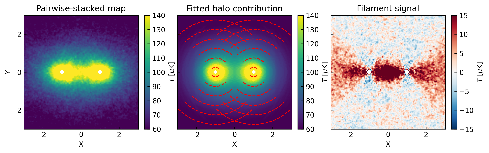

# Mytools


## Description
This is a collection of python tools used in my work on [HI filament stacking simulation](https://arxiv.org/abs/2411.03988), including utilities for data processing, plotting, and calculations.

The code is organized into several modules, each with its own specific functionality.
The main modules are:
* ```data.py           ```: to manipulate the hdf5 files (save, read...),
* ```plot.py           ```: to plot multiple figures(heatmap, histogram, line, arcs...),
* ```constant.py       ```: defined some constants for 21cm astronomy (rest_frequency...),
* ```calculation.py    ```: to calculate some quantities (beamsize, sensitivity...),
* ```stack.py          ```: to aid the stacking procedure,
* ```halo.py           ```: to finish halo component fiting and subtraction (**original** code used in paper),
* ```halo_new.py       ```: optimised version of halo-contriubiton subtraction (**recommanded**),
* ```utils.py          ```: utilities for fiting (get coodinates, mask...),
* ```estimate.py       ```: to estimate the signal level,
* ```bins.py           ```: helper functions for bins.

There are also useful scripts in the [scripts](scripts) folder:
* ```convolve.py       ```: to finish beam convolution (FAST main beam),
* ```pair_stack.py     ```: to run the galaxy pairwise stacking.
* ```find_fuzzy_par.py ```: to find the indices of inner fuzzy particles for filament only map construction.

## Install
You can simply git clone this repository and and install it with ```pip install .```

Or directly use:
```sh
pip install git+https://github.com/dyliu0312/mytools.git
```

## Dependency
It was tested on Python>=3.8, and requires the following packages:
* [numpy](https://numpy.org/)
* [matplotlib](https://matplotlib.org/)
* [h5py](https://www.h5py.org/)
* [astropy](https://www.astropy.org/)
* [scipy](https://scipy.org/)

Optional:
* [tqdm](https://github.com/tqdm/tqdm) (for [pair_stack.py](scripts/pair_stack.py) script)
* [illustris_python](https://github.com/illustristng/illustris_python.git) (for [find_fuzzy_par.py](scripts/find_fuzzy_par.py) script)

## Usage

After installing, you can use the functions in the modules, for example:
```py
from mytools.calculation import freq2z, u
freq2z(1.3*u.GHz)
```
## Notes
1. The example Jupyter notebook for **filament signal estimation** is in the [example](example) folder.

2. Other example Jupyter notebooks for **functionality usage** are in the [test](test) folder.


3. To run the [```pair_stack.py```](scripts/pair_stack.py) script, please **see and modify** the example parameters set in the [pair_stack.sh](slurm/pair_stack.sh) file.

Have fun!


